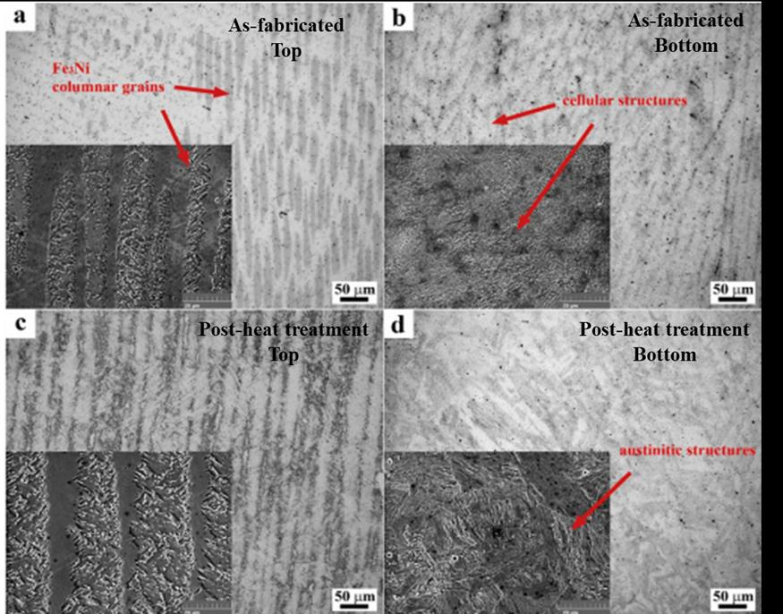

# Materials Modeling

> SEM-based microstructural characterization and failure analysis term project

       


### 🌐 Live project page → **https://selsaady1.github.io/mse550-materials-modeling/**

## Overview
A graduate materials-characterization (MSE 550, Advanced Materials Characterization) term project on the use of Scanning Electron Microscopy for microstructural characterization and failure analysis of materials. The deliverables include a peer-reviewed-literature term paper proposal, a 250-word abstract/synopsis, a 17-slide technical presentation, and a Python/Jupyter notebook that generates synthetic microstructure figures. The work covers SEM electron-matter interactions, detection modes (SE, BSE, EDS, EBSD, cathodoluminescence), and two literature case studies.

## Key Achievements
- Authored and presented a 17-slide technical talk on SEM for microstructural characterization and failure analysis, grounded in four recent peer-reviewed journal references (2023-2024).
- Built a literature case study on correlative microscopy of the Aba Panu L3 chondrite meteorite, summarizing SEM-EDS + X-ray computed tomography + nanoindentation results across five mineral phases (e.g., olivine ~202.7 GPa modulus, 16.4 GPa hardness).
- Developed a second case study on SEM fractography of dental ceramics and polymers plus computational/machine-learning methods for quantitative fatigue-striation analysis of polycrystalline materials.
- Wrote a Jupyter/Python notebook that synthesizes four illustrative microstructure figures (polycrystalline grain boundaries, stress-induced void formation, stress distribution, and delamination initiation) using NumPy and SciPy Gaussian filtering, exported at 300 DPI.
- Produced a formal paper proposal with tentative/final titles, a 250-word abstract, and a detailed section outline (Introduction, Technique Description, two case studies, Summary).

## Approach
The project explains SEM fundamentals (elastic/inelastic electron scattering, characteristic X-ray and cathodoluminescence generation) and analytical detection modes, then applies them through two case studies drawn from recent journal literature. One case examines multimodal correlative microscopy (SEM-EDS, XCT, nanoindentation) of a meteorite; the other examines SEM fractography and emerging computational striation-analysis methods for failure prediction. A supporting notebook procedurally generates synthetic SEM/TEM-style images with NumPy array tiling and SciPy Gaussian smoothing for figure illustration.

## Tools & Technologies
- Python
- Jupyter Notebook
- NumPy
- SciPy (ndimage)
- Matplotlib
- Microsoft PowerPoint
- Microsoft Word

## Gallery





## Repository Structure
```
.gitignore
.nojekyll
LICENSE
README.md
docs/MSE 550 Term Paper.pdf
docs/MSE550_Presentation_Elsaady.pptx
docs/MSE550_Presentation_Elsaady.pptx.pdf
docs/MSE550_Synopsis.docx
docs/PAPERIDEA.pdf
docs/m550-good-slides-example.pdf
images/fig1.png
images/fig2.png
images/fig3.png
images/fig4.png
images/fig5.png
images/fig6.png
images/preview.png
index.html
src/MSE550.ipynb
```

## Results
Delivered a complete term-paper proposal, abstract, 17-slide presentation, and a figure-generating notebook; the presentation synthesizes literature findings (including reported mineral-phase moduli/hardness values such as olivine ~202.7 GPa modulus and 16.4 GPa hardness) to conclude that modern SEM bridges microstructural features and macroscopic mechanical performance.

## Deliverable
See [`docs/MSE550_Presentation_Elsaady.pptx.pdf`](docs/MSE550_Presentation_Elsaady.pptx.pdf).

## License
MIT — see [`LICENSE`](LICENSE).

---
_Part of [Saif Elsaady's engineering portfolio](https://selsaady1.github.io/portfolio/). Deliverables only — routine homework/quizzes/exams excluded._