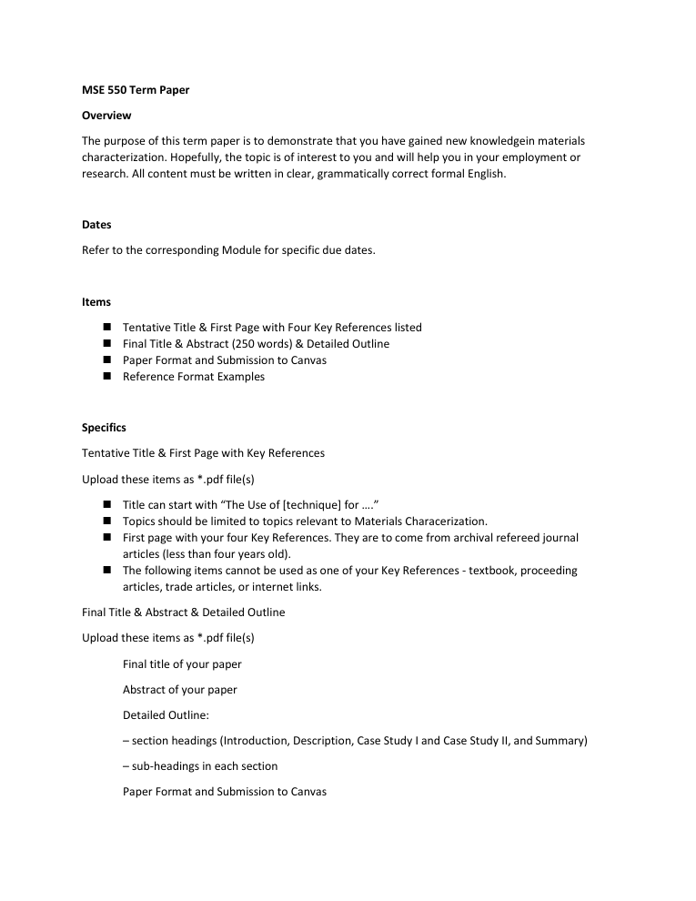

# Materials Modeling

> Coursework project. Area: research.

## Overview
This repository contains my project deliverables (pulled from my own project files).

## Tools & Tech
- Jupyter/Python
- PDF report
- presentation
- report (Word)

## Repository Structure
```
.gitignore
LICENSE
README.md
docs/MSE 550 Term Paper.pdf
docs/MSE550_Presentation_Elsaady.pptx
docs/MSE550_Presentation_Elsaady.pptx.pdf
docs/MSE550_Synopsis.docx
docs/PAPERIDEA.pdf
docs/m550-good-slides-example.pdf
images/preview.png
src/MSE550.ipynb
```

## Code
Source is in `src/`. Provided as submitted; not independently re-run here.

## Results
See `docs/GUIDELINES  (for presentation slides):.docx`.

## Preview


## License
MIT — see `LICENSE`.

---
_Part of my engineering coursework portfolio. Deliverables only._